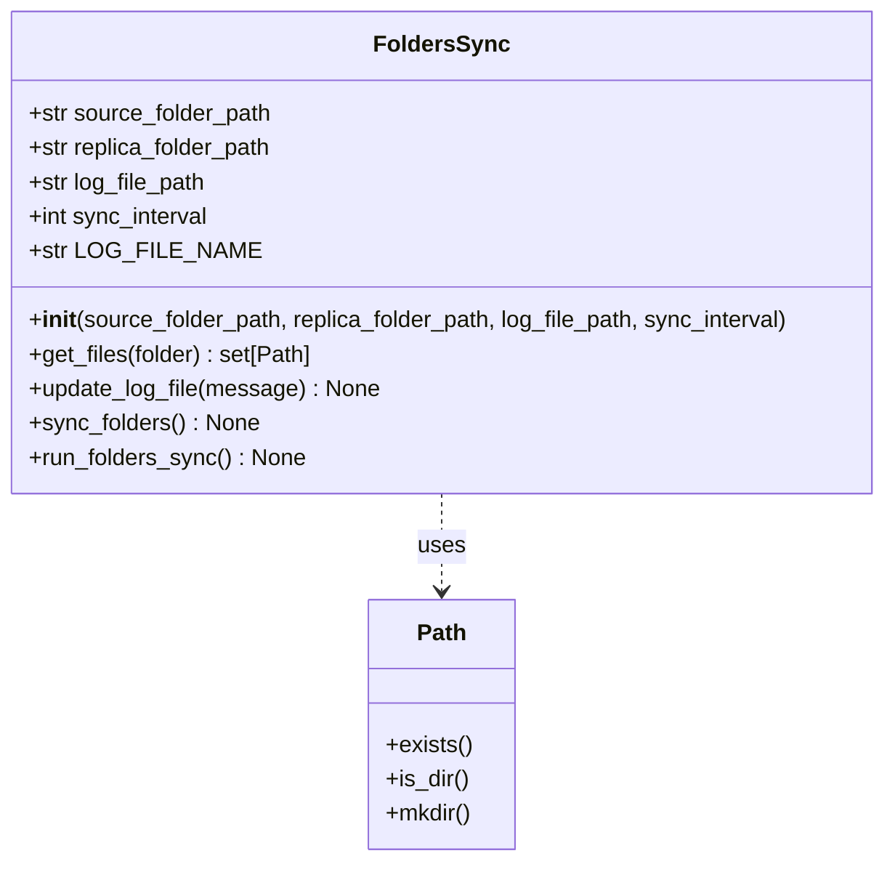

# Folders Sync Program

A program that performs one-way synchronization between folders, creating and maintaining an exact replica of a source folder while logging all operations.

## Description

This Python-based tool provides automated folder synchronization capabilities. It monitors a source folder and maintains an identical copy in a replica folder, with all file operations (creation, modification, deletion) being logged both to a file and the console in real-time.

## Features

- One-way synchronization from source to replica folder
- Configurable synchronization intervals (minutes, hours, or days)
- Comprehensive logging of all file operations
- Support for nested folder structures
- Interactive command-line interface
- Cross-platform compatibility

## Requirements

- Python 3.10 or higher
- No additional dependencies required (uses standard library only)

## Usage

Run the program by executing `main.py`:

```bash
python main.py
```

The program will interactively prompt you for:

1. Source folder path
2. Replica folder path
3. Log file path
4. Synchronization interval (format: number + unit)
   - `m` for minutes (max 59)
   - `h` for hours (max 23)
   - `d` for days (max 30)

Example inputs:
```
Source Folder Path: /path/to/source
Replica Folder Path: /path/to/replica
Log File Path: /path/to/logs
Synchronization Interval: 5m
```

## Implementation Details

The program consists of two main components:

- `main.py`: Handles user input, validation, and program initialization
- `folders_sync.py`: Contains the core `FoldersSync` class implementing synchronization logic

### Synchronization Process:

1. Scans both source and replica folders
2. Identifies files that need to be created, updated, or deleted
3. Performs necessary file operations
4. Logs all actions with timestamps
5. Waits for the specified interval before next sync

## Project Structure

```
Folders-Sync-Program/
├── src/
│   ├── main.py
│   └── folders_sync.py
├── README.md
└── [User-specified folders]
    ├── Source Folder/
    ├── Replica Folder/
    └── Log Folder/
        └── sync_log_file.txt
```

## Important Notes

- The log folder must be different from source and replica folders
- Source and replica folders must be different directories
- All specified folders must exist before running the program
- Program can be terminated using Ctrl+C
- Invalid inputs will prompt for retry or program termination
- All operations are logged with timestamps in both console and log file

## Program Flow

```
1. Show welcome message and instructions
2. Get and validate folder paths and sync interval
3. Initialize FoldersSync with provided parameters
4. Start continuous synchronization loop
5. Log all operations in real-time
6. Repeat after specified interval
```

## Class Diagram


